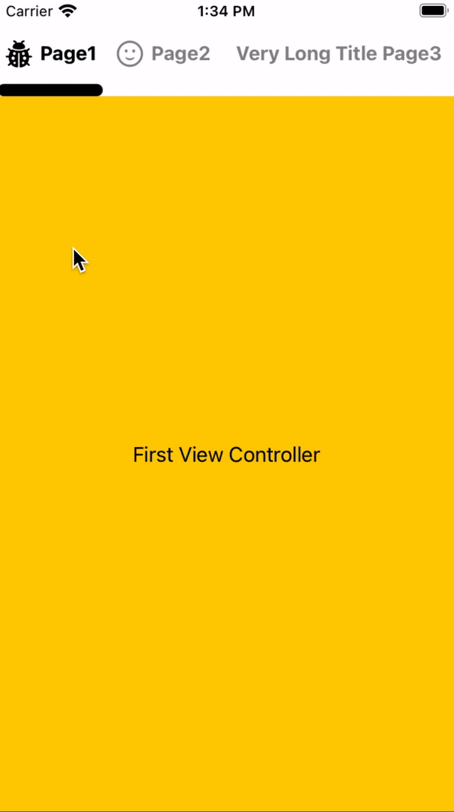

[Swift Version](https://img.shields.io/badge/platform-ios-orange/?style=for-the-badge&color=blue)

[Platform](https://img.shields.io/badge/platform-ios-orange/?style=for-the-badge&color=blue)

# SegmentedPageViewController
SegmentedPageViewController is a ViewController which containts a custom SegmentedControll and a UIPageViewController synced together.

<p align="center">
  
</p>

Image below briefly explains the components of SegmentedPageViewController and how they are connected together.

[Explanation Image](images/map.png)

## installation
Just copy the 3 files [`SegmentedPageViewController` - `SPSegmentedControll` - `SPSegmentedControllItem`] of SegmentPageViewController directory into your project.

## Usage Examples
Here is a `SegmentedPageViewController` with 3 pages.
```
let segmentedPageVC = SegmentedPageViewController(
    pages: [
        .init(viewController: viewcontrollers[0],
              icon: UIImage(systemName: "ladybug"),
              selectedIcon: UIImage(systemName: "ladybug.fill"),
              title: "Page1"),
        
        .init(viewController: viewcontrollers[1],
              icon: UIImage(systemName: "face.smiling"),
              selectedIcon: UIImage(systemName: "face.smiling.fill"),
              title: "Page2"),
        
        .init(viewController: viewcontrollers[2],
              title: "Very Long Title Page3")
    ]
    
    ,segmentControllerFillMode: .proportionally)
```
The initializer gets 2 variables:

* `pages` is an array of `SegmentedPageViewController.Page`. Each page should have a ViewController and a title. You can also pass an icon and a selected icon. selected icon replace the icon when page get selected.

* `segmentControllerFillMode` defines how `SPSegmentedControll` should distribute its Items. Use `.equally` if your `SegmentPageViewController.Page` titles length are equal and use `.proportionally` if you have titles with different lengths.

Then add it to your view just like any other ViewController.
```
self.addChild(segmentedPageVC)
view.addSubview(segmentedPageVC.view)
segmentedPageVC.didMove(toParent: self)
```


You can customize the appearance of SPSegmentedController using its variables like this:

```
segmentedPageVC.segmentController.highlightColor = .systemRed
segmentedPageVC.segmentController.textColor = .systemGray6
segmentedPageVC.segmentController.font = UIFont.systemFont(ofSize: 15, weight: .semibold)

segmentedPageVC.segmentController.underlineHeight = 20
segmentedPageVC.segmentController.itemsHeight = 40
segmentedPageVC.segmentController.spacing = 10

segmentedPageVC.segmentController.underlineImageViewCornerRadius = 5

// this would fill the underlineImageView background with highlight color.
segmentedPageVC.segmentController.underlineImage = nil

// this would set the image of underlineImageView and clear underlineImageView background.
segmentedPageVC.segmentController.underlineImage = UIImage(systemName: "triangle.fill")

```
Also checkout the demo project for more info and a full example of `SegmentedPageViewController` implementation.
